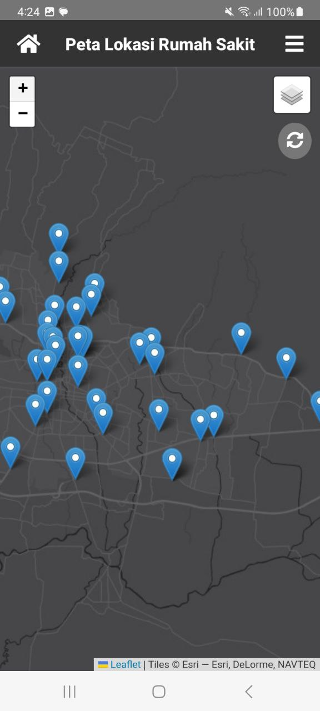
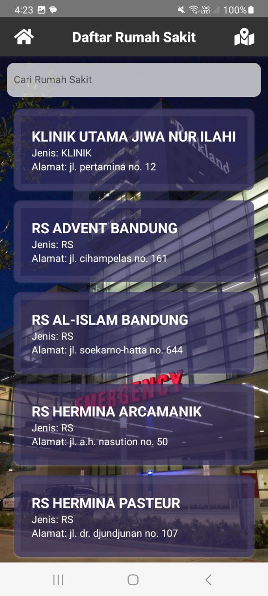
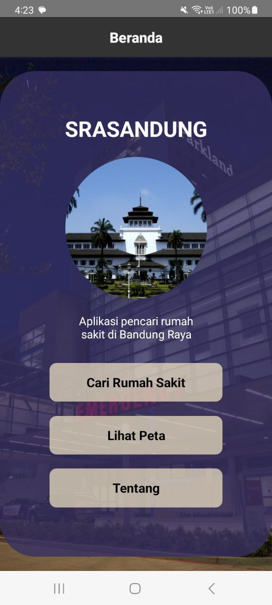

# react-native-app-srasandung
   Aplikasi SRASANDUNG (Persebaran Rumah Sakit Bandung) merupakan aplikasi untuk mencari rumah sakit di Bandung Raya. Harapan dibuatnya aplikasi ini adalah dapat membantu warga Bandung dan sekitarnya dalam mencari informasi rumah sakit yang terdaftar
   secara resmi di Kementrian Kesehatan.

## Stack
   1. React native
   2. HTML
   3. LeafletJS
   4. Google Spreadsheets
   5. Apps Script
   6. FontAwesome5
   7. Github

### Sumber Data
   Sumber data lokasi rumah sakit didapatkan dari open data jabar yang diakses melalui https://dashboard.jabarprov.go.id/id/topic/kesehatan/sebaran-rumah-sakit-jawa-barat 

#### Komponen Produk

